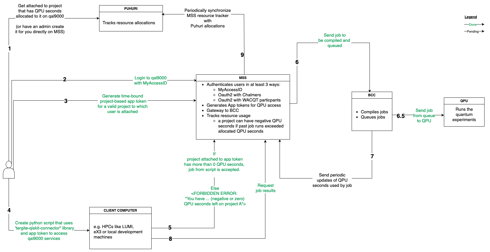

# Authentication and Authorization

This is how MSS authenticates its users and controls their access to the quantum computer resource.

## Authentication

- It uses [Oauth2](https://oauth.net/2/), a standard similar to HTTP in the sense that for any system, 
 also called an **Oauth2 client**, to allow its users to authenticate with another system, 
 called an **Oauth2 provider**, all that is needed are two strings:
  - `CLIENT_ID`
  - `CLIENT_SECRET`
- The two strings are unique to this system, but are given by the Oauth2 provider
- Common Oauth2 providers include Google, Github, Microsoft, Chalmers (which uses Microsoft)
- Organizations which have a sort of ActiveDirectory can automatically be Oauth2 providers.
- We also use [OpenID Connect]() which is a flavour of Oauth2 that requires a third string, a `CONFIG_URI`,
 from where to get the configuration of the openID provider.

### How to Set Up a New Oauth2 Provider

- Let's say we want some 'Erikson' users to have access to MSS.
- Update the `.env` file in the project root directory to include:

```shell
ERIKSON_CLIENT_ID=<some-openid-client-id>
ERIKSON_CLIENT_SECRET=<some-openid-client-secret>
# ERIKSON_CONFIG_ENDPOINT is necessary if Erikson uses OpenID Connect, otherwise ignore.
ERIKSON_CONFIG_ENDPOINT=<some-openid-config-endpoint>
# the regex validation for emails to allow for this login. default: ".*"
ERIKSON_EMAIL_REGEX=".*"
# Roles that are automatically given to users who authenticate through Erikson
# roles can be: "admin", "user", "researcher", "partner". Default is "user".
ERIKSON_ROLES="partner,user"
# the URL to redirect to after user authenticates with the system.
# It is of the format {MSS_BASE_URL}/auth/app/{provider_name}/callback
ERIKSON_COOKIE_REDIRECT_URI=https://api.qal9000.se/auth/app/erikson/callback
```

- Update the [`settings.py`](../settings.py) file in the project root directory to read the environment variables you have added, 
 plus the name of this authentication method.

```python
ERIKSON_CLIENT_NAME = "erikson"
ERIKSON_CLIENT_ID = config("ERIKSON_CLIENT_ID", cast=str, default=None)
ERIKSON_CLIENT_SECRET = config("ERIKSON_CLIENT_SECRET", cast=str, default=None)
ERIKSON_CONFIG_ENDPOINT = config("ERIKSON_CONFIG_ENDPOINT", cast=str, default=None)
ERIKSON_COOKIE_REDIRECT_URI = config(
    "ERIKSON_COOKIE_REDIRECT_URI", cast=str, default=None
)
```

- Add the erikson authentication routes to the [`api/routers/auth.py`](../api/rest/routers/auth.py) file.

```python
# If Erikson uses microsoft to handle its users, we use the `get_microsoft_client` utility
# If openID, we use `get_openid_client`
# For any other provider, we can create similar utility functions, in services/auth/users/__init__.py
# Just copy, and paste, and change the return value.
# or instead of the utility, import the client from `httpx_oauth.clients`
_ERIKSON_OAUTH_CLIENT = get_microsoft_client(
    client_id=settings.ERIKSON_CLIENT_ID,
    client_secret=settings.ERIKSON_CLIENT_SECRET,
    name=settings.ERIKSON_CLIENT_NAME,
)

# for non-browser based auth i.e. no cookies
router.include_router(
    JWT_AUTH.get_oauth_router(
        oauth_client=_ERIKSON_OAUTH_CLIENT,
        backend=JWT_HEADER_BACKEND,
        state_secret=settings.JWT_SECRET,
        is_verified_by_default=True,
    ),
    prefix=f"/{_ERIKSON_OAUTH_CLIENT.name}",
    tags=["auth"],
)

# For browser based auth
router.include_router(
    JWT_AUTH.get_oauth_router(
        oauth_client=_ERIKSON_OAUTH_CLIENT,
        backend=JWT_COOKIE_BACKEND,
        state_secret=settings.JWT_SECRET,
        is_verified_by_default=True,
        redirect_url=settings.ERIKSON_COOKIE_REDIRECT_URI,
    ),
    prefix=f"/app/{_ERIKSON_OAUTH_CLIENT.name}",
    tags=["auth"],
)
```

- Update the [Landing page](https://github.com/tergite/tergite-landing-page) to include this provider also. 
 The instructions are found in the [auth docs](https://github.com/tergite/tergite-landing-page/src/main/docs/auth.md)
- Start MSS. 
  Instructions are on the [README.md](../README.md)
- Start the landing page.
  Instructions are on its [README.md](https://github.com/tergite/tergite-landing-page/src/main/README.md)

## Authorization

- We control access to MSS, and its BCCs using two ways
  - `roles` control basic access to auth-related endpoints e.g. project creation, token management etc.
  - `projects` control access to all other endpoints. To create a job, or get its results etc, 
     one must be attached to a project that has more than zero QPU seconds.
- QPU seconds are the number of seconds a project's experiments are allocated on the quantum computer.
- QPU seconds can be increased, decreased etc., but no job can be created without positive QPU seconds.
- A job could run for longer than the allocated project QPU seconds but 
  it may fail to update MSS of its results. A user must thus make sure their project has enough QPU seconds.

### How Authorization Works

Here is an interaction diagram of QAL9000 auth showcasing authentication via [MyAccessID](https://ds.myaccessid.org/).




**The raw editable drawio diagram can be found [in the assets folder](./assets/qal9000-auth.drawio)**