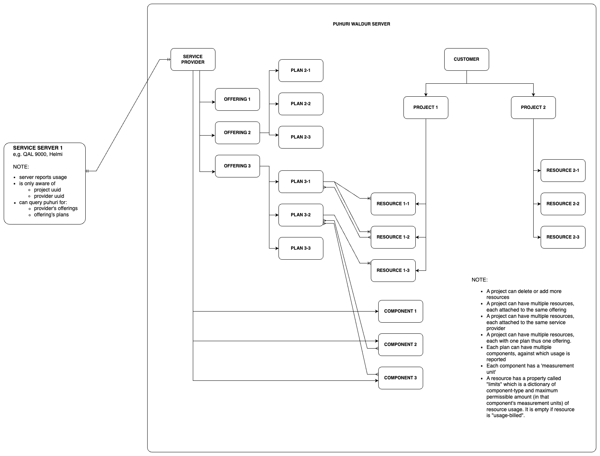
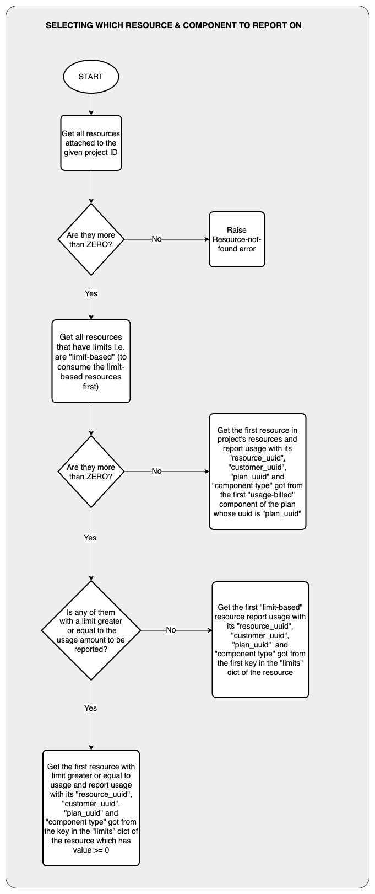

# Authentication and Authorization

This is how MSS authenticates its users and controls their access to the quantum computer resource.

## Authentication

- It uses [Oauth2](https://oauth.net/2/), a standard similar to HTTP in the sense that for any system, 
 also called an **Oauth2 client**, to allow its users to authenticate with another system, 
 called an **Oauth2 provider**, all that is needed are two strings:
  - `CLIENT_ID`
  - `CLIENT_SECRET`
- The two strings are unique to this system, but are given by the Oauth2 provider
- Common Oauth2 providers include Google, Github, Microsoft, Chalmers (which uses Microsoft)
- Organizations which have a sort of ActiveDirectory can automatically be Oauth2 providers.
- We also use [OpenID Connect]() which is a flavour of Oauth2 that requires a third string, a   
 `OPENID_CONFIGURATION_ENDPOINT`, from where to get the configuration of the openID provider.

### How to Set Up a New Oauth2 Provider

- Let's say we want some 'Ericsson' users to have access to MSS.
- Copy the `auth_config.example.toml` to `auth_config.toml`, and update the configs therein.  
  Note: You could also create a new toml file based on `auth_config.example.toml`   
  and set the `AUTH_CONFIG_FILE` environment variable to point to that file.
- Add the new client:

```toml
[[clients]]
# this name will appear in the URLs e.g. http://127.0.0.1:8002/auth/app/ericsson/...
name = "ericcson"
client_id = "some-openid-client-id"
client_secret = "some-openid-client-secret"
# the URL to redirect to after user authenticates with the system.
# It is of the format {MSS_BASE_URL}/auth/app/{provider_name}/callback
redirect_url = "http://127.0.0.1:8002/auth/app/ericsson/callback"
client_type = "openid"
email_regex = ".*"
# Roles that are automatically given to users who authenticate through Ericsson
# roles can be: "admin", "user", "researcher", "partner". Default is "user".
roles = ["partner", "user"]
# openid_configuration_endpoint is necessary if Ericsson uses OpenID Connect, otherwise ignore.
openid_configuration_endpoint = "https://proxy.acc.puhuri.eduteams.org/.well-known/openid-configuration"
```

- Update the [Landing page](https://github.com/tergite/tergite-landing-page) to include this provider also.
  The instructions are found in the [auth docs](https://github.com/tergite/tergite-landing-page/src/main/docs/auth.md)
- Start MSS.
  Instructions are on the [README.md](../README.md)
- Start the landing page.
  Instructions are on its [README.md](https://github.com/tergite/tergite-landing-page/src/main/README.md)

## Authorization

- We control access to MSS, and its BCCs using two ways
  - `roles` control basic access to auth-related endpoints e.g. project creation, token management etc.
  - `projects` control access to all other endpoints. To create a job, or get its results etc,
    one must be attached to a project that has more than zero QPU seconds.
- QPU seconds are the number of seconds a project's experiments are allocated on the quantum computer.
- QPU seconds can be increased, decreased etc., but no job can be created without positive QPU seconds.
- A job could run for longer than the allocated project QPU seconds but
  it may fail to update MSS of its results. A user must thus make sure their project has enough QPU seconds.

### How Authorization Works

Here is an interaction diagram of QAL9000 auth showcasing authentication via [MyAccessID](https://ds.myaccessid.org/).


**The raw editable drawio diagram can be found [in the assets folder](./assets/qal9000-auth.drawio)**

### FAQs

#### - How do we bypass authentication in development?

We use feature flag `is_enabled` property in the `auth_config.toml` file, setting it to `false`

```toml
is_enabled = false
```

**Note: `/auth` endpoints will still require authentication because they depend on the current user**

#### - How do we ensure that in production, authentication is always turned on?

On startup, we raise a ValueError when `is_enabled = false` in the `auth_config.toml` file yet   
environment variable `APP_SETTINGS=production` and log it.

#### - How do we allow other qal9000 services (e.g. BCC or calibration workers) to access MSS, without user intervention?

Use app tokens created by any user who had the 'system' role.
The advantage of using app tokens is that they are more secure because they can easily be revoked and scoped.
Since they won't be used to run jobs, their project QPU seconds are expected not to run out.

If you are in development mode, you can just switch of authentication altogether.

#### How do I log in?

- You need to run both [MSS](https://github.com/tergite/tergite-mss/) and the [landing page](https://github.com/tergite/tergite-landing-page/).
- **Make sure that your `.env` files have all variables filled appropriately** for example, both applications should have the same `JWT_SECRET`.
- The landing page, when running, has appropriate links, say in the navbar, to direct you on how to the authentication screens.
- However, you can also log in without running the landing page app first. See the next FAQ.

#### How do I log in without having to run the landing page?

- **Make sure that your `.env` file has all variables filled appropriately**.
  The `dot-env-template.txt` is a good template to copy from, but it must all placeholder (`<some-stuff>`) must be replaced in the actual `.env` file.
- Run the application

```shell
./start_mss.sh
```

- Visit the http://localhost:8002/auth/github/authorize endpoint in your browser if you are running on local host.
- Copy the “authorization_url” from the response and paste it in another tab in your browser. Follow any prompts the browser gives you.
- After you are redirected back to http://localhost:8002/auth/github/callback, you should see an “access_token”. Copy it to your clipboard.  
  If you run into any errors, ensure that the `TERGITE_CLIENT_ID` and `TERGITE_CLIENT_SECRET` in your `.env` file are appropriately set.
- You can then try to create an app token or anything auth related using `curl` or [postman](https://www.postman.com/).  
  To authenticate those requests, you must always pass an "Authorization" header of format `Bearer <access_token>`.  
  **Do note that this auth token can only be used on `/auth/...` endpoints. It will return 401/403 errors on all other endpoints**.
- Do note also that some endpoints are only accessible to users that have a given role e.g. 'admin' or 'system' etc.

#### How does BCC get authenticated?

- A client (say [tergite-qiskit-connector](https://github.com/tergite/tergite-qiskit-connector)) sends a `POST`
  request is sent to `/jobs` on MSS (this app) with an `app_token` in its `Authorization` header
- A new job entry is created in the database, together with a new unique `job_id`.
- MSS notifies BCC of the `job_id` and its associated `app_token` by sending a `POST` request to `/auth` endpoint
  of [BCC](https://github.com/tergite/tergite-bcc).
- In the response to the client, MSS returns the `/jobs` url for the given BCC backend
- The client then sends its experiment data to the BCC `/jobs` url, with the same `app_token` in
  its `Authorization` header and the same `job_id` in the experiment data.
- BCC checks if the `job_id` and the `app_token` are first of all associated, and if no other experiment data has
  been sent already with the same `job_id`-`app_token` pair. This is to ensure no user attempts to fool the system
  by using the same `job_id` for multiple experiments, which is theoretically possible.
- If BCC is comfortable with the results of the check, it allows the job to be submitted. Otherwise, either a 401
  or a 403 HTTP error is thrown.
- The same `job_id`-`app_token` pair is used to download raw logfiles from BCC at `/logfiles/{job_id}` endpoint.
  This time, BCC just checks that the pair match but it does not check if the pair was used already.
- This is the same behaviour when reading the job results at `jobs/{job_id}/result`
  or the job status at `jobs/{job_id}/status` or the entire job entry at `jobs/{job_id}` in BCC.
- This is also the same behaviour when attempting to delete the job at `/jobs/{job_id}` or to cancel it at
  `/jobs/{job_id}/cancel` in BCC.

## Puhuri

[Puhuri](https://puhuri.neic.no/) is an HPC resource management platform that could also be used to manage Quantumm Computer systems.

We need to synchronize MSS's resource management with that in Puhuri

The Puhuri Entity Layout


### Flows



### Assumptions

- When creating components in the puhuri UI, the 'measurement unit's
  set on the component are of the following possible values:
  'second', 'hour', 'minute', 'day', 'week', 'half_month', and 'month'.
